## Task 1
# Use “Get-Help” to find out more information about 5 cmdlets.
Get-Help with Get-Location
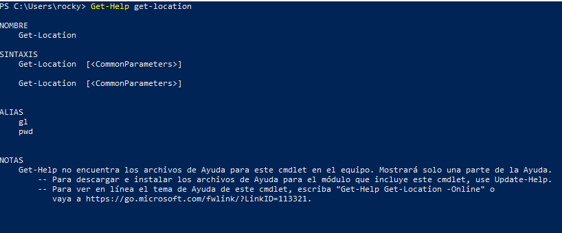

Get-Help with copy-item
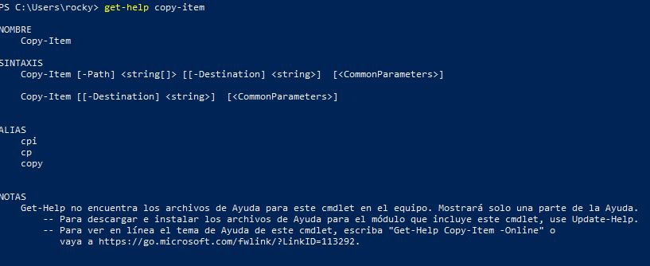
Get-Help with New-Item
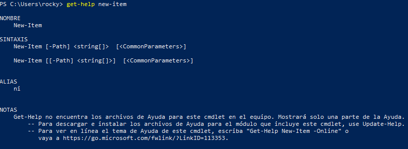
Get-Help with Rename-Item
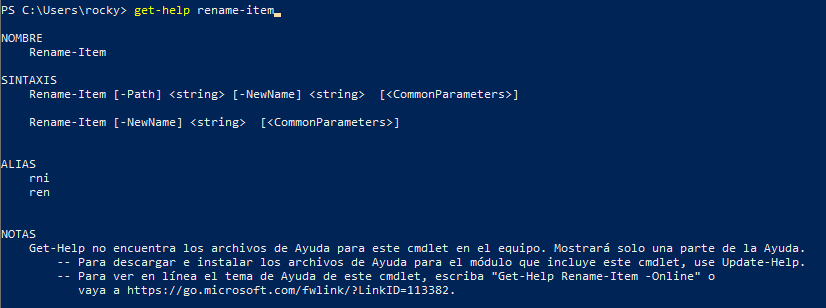
Get-Help with Remove-item
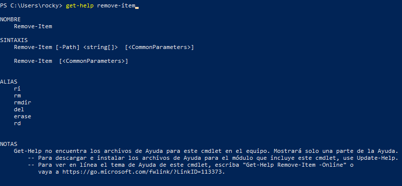
## Task 2 
# Use “Get-Help” with the “–Example” parameter for the 5 cmdlets you discovered more about in task 1.
Examples with get-location
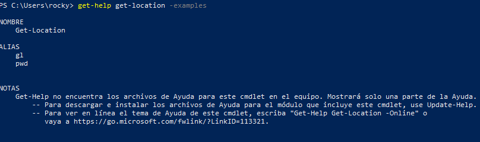
Examples with copy-items
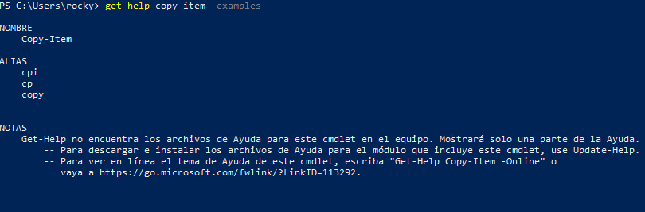
Examples with new-item
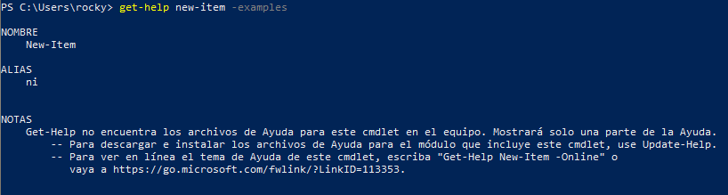
Examples with rename-item
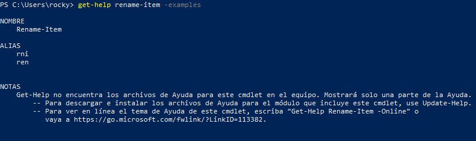
Examples with remove-item
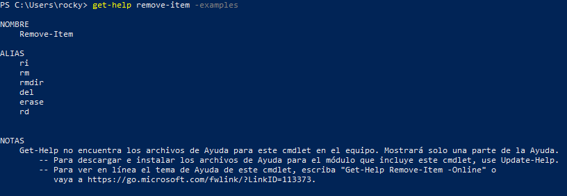
## Task 3 
# Create a new text file named “TestFile.txt” under C:\Maximo\PowerShell\Workshop1\%USERNAME%
Creamos la carpeta Maximo:
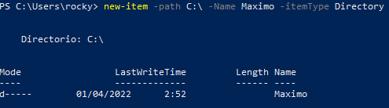
Creamos la carpeta PowerShell:
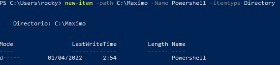
Creamos la carpeta Workshop1:
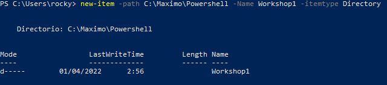
Creamos la carpeta %USERNAME%:
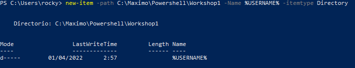
Creamos el archivo Testfile.txt:
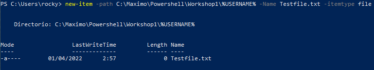
## Task 4
# Populate the text file you created in task 3 with all three datatypes we’ve covered: “Boolean”, “String” and “Int”
Añadimos un booleano, un String y un Int al archivo “Testfile.txt”
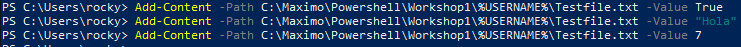
## Task 5 
# Read from the text file and use “Get-Member” to find the datatype returned
Ejecutamos:
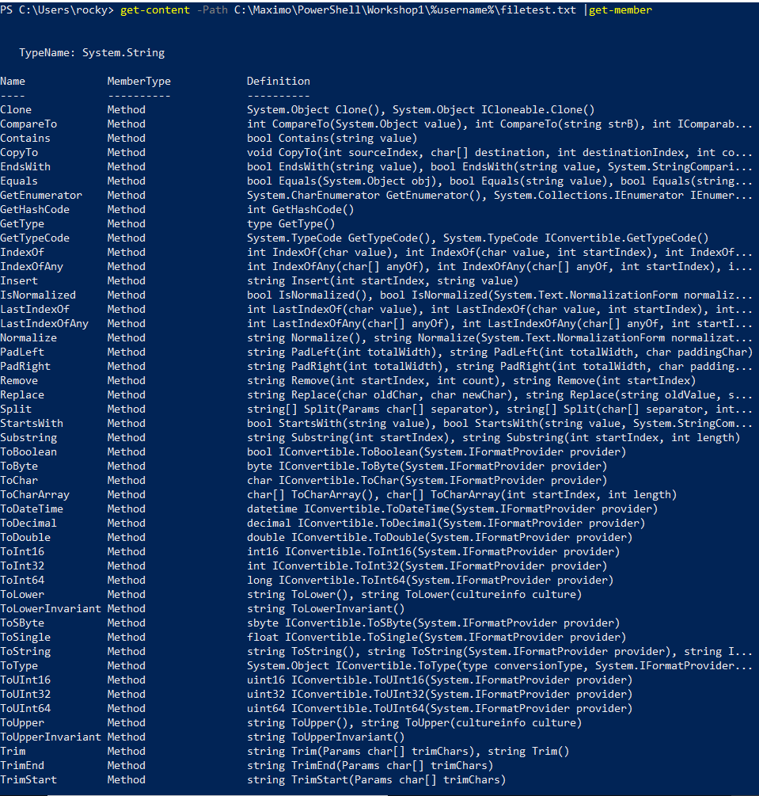
## Task 6
# Overwrite all data within the text file that you created in task 3.
Cambiamos todo el contenido de “Testfile.txt”:
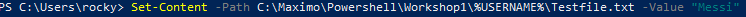

## Task 7 
# Format the data returned by a cmdlet into a list
Ejecutamos: (Esto solo es una parte de todo lo que muestra)
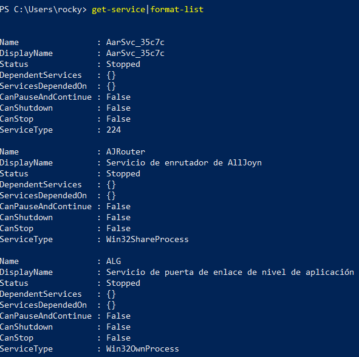
## Task 8
# Pipe “Get-Command” into “Out-GridView”
Ejecutamos:

Nos abrirá una ventana con mucho contenido, esto solo es una parte:
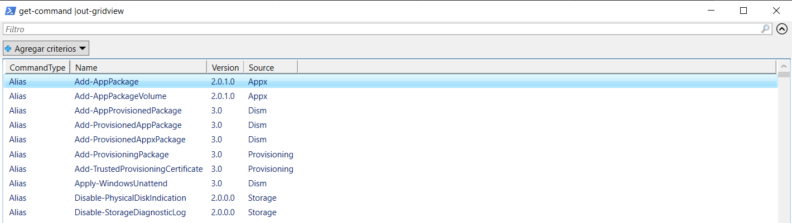
## Task 9
# Pipe the 5 cmdlets you discovered in task 1 into “Out-GridView”
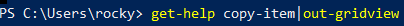
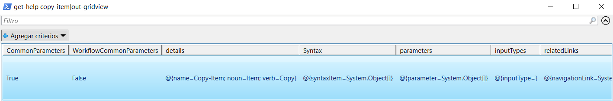

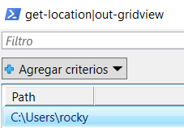
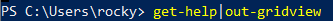
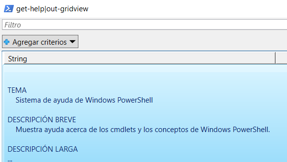

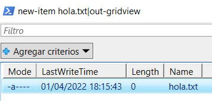
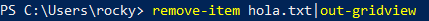
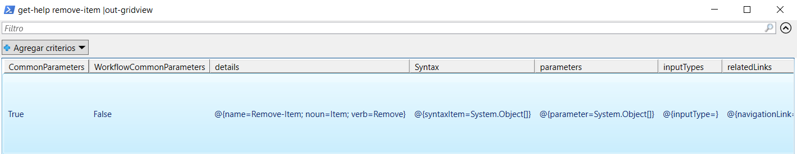
## Task 10
# Find the official PowerShell documentation library from Microsoft
El enlace para llegar a la documentación es:
[documentación powershell](https://docs.microsoft.com/en-us/powershell/)
